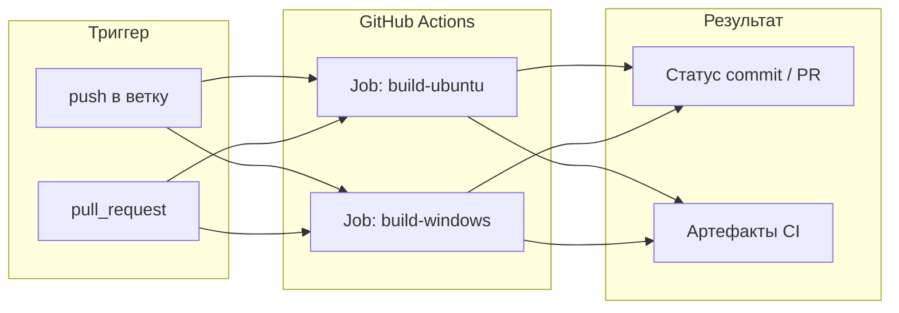

# CI: автоматическая сборка при push в GitHub

Документ описывает, как может выглядеть пайплайн непрерывной интеграции для проекта **shacal**: сборка исполняемого файла `shacal_cli` на **Ubuntu** и **Windows** при каждом push (и при pull request) в репозиторий на GitHub.

Реализация предполагается через **[GitHub Actions](https://docs.github.com/en/actions)** - встроенный CI/CD без отдельного сервера.

---

## Цели пайплайна

| Цель | Описание |
|------|----------|
| Проверка компиляции | Убедиться, что код собирается на Linux (GCC) и Windows (MSVC) |
| Единая точка сборки | Один `CMakeLists.txt` для всех платформ |
| Артефакты | Сохранить бинарники как downloadable artifacts (опционально) |
| Быстрая обратная связь | Статус проверки виден в PR и в списке коммитов |

На первом этапе CI **не запускает** приложение с тестовыми данными - только конфигурирует и собирает проект. Smoke-тесты и эталонные векторы можно добавить позже (см. [roadmap.md](roadmap.md)).

---

## Общая схема



Оба job'а выполняются **параллельно** и не зависят друг от друга.

---

## Структура репозитория

```
.github/
  workflows/
    build.yml          # основной workflow сборки
CMakeLists.txt
src/
  core/                # чистое ядро -> libshacal_core
  io/                  # файловый/BMP-слой -> libshacal_io
  cli/                 # main.cpp + stats -> shacal_cli
docs/
  ci_build.md          # этот документ
```

Файл workflow кладётся в `.github/workflows/` - GitHub подхватывает его автоматически после push в default-ветку (обычно `main` или `master`).

---

## Триггеры

Типичная конфигурация:

```yaml
on:
  push:
    branches: [ main, master, develop ]
  pull_request:
    branches: [ main, master, develop ]
```

| Событие | Когда запускается |
|---------|-------------------|
| `push` | Любой push в указанные ветки |
| `pull_request` | Открытие PR, новые коммиты в PR, reopen |

Дополнительно можно ограничить запуск только изменениями в исходниках:

```yaml
on:
  push:
    paths:
      - 'src/**'
      - 'CMakeLists.txt'
      - '.github/workflows/**'
```

---

## Job: Ubuntu (Linux)

**Runner:** `ubuntu-latest` (актуальный LTS-образ GitHub).

**Компилятор:** GCC из пакетов Ubuntu (по умолчанию в образе) или явно `g++-13` / `clang++`.

**Шаги:**

1. **Checkout** - `actions/checkout@v4`
2. **Зависимости** - `cmake`, `ninja-build` (или сборка через Make)
3. **Configure** - out-of-source build в каталоге `build/`
4. **Build** - `cmake --build build --config Release`
5. **Upload artifact** - `build/shacal_cli`

Пример configure/build:

```bash
cmake -S . -B build -DCMAKE_BUILD_TYPE=Release
cmake --build build --parallel
```

Ожидаемый результат:

```
build/shacal_cli          # единственный артефакт сборки
```

Дополнительные файлы рядом с бинарником **не требуются**: раундовые константы
SHACAL-1 по умолчанию встроены в программу; при необходимости их можно задать
флагами `--round-consts` или `--round-consts-file` при запуске (см. [README.md](../README.md)).

Флаги предупреждений уже заданы в `CMakeLists.txt`: `-Wall -Wextra -Wpedantic`.

---

## Job: Windows

**Runner:** `windows-latest`.

**Компилятор:** MSVC (Visual Studio Build Tools), подключается через генератор CMake.

**Шаги:** те же по смыслу - checkout, CMake, build, upload.

Рекомендуемый генератор для GitHub-hosted Windows:

```powershell
cmake -S . -B build -G "Visual Studio 17 2022" -A x64
cmake --build build --config Release --parallel
```

Ожидаемый результат:

```
build/Release/shacal_cli.exe
```

На Windows путь к бинарнику включает подкаталог `Release/` (или `Debug/` при другой конфигурации). В workflow артефакт лучше собирать через `$<TARGET_FILE:shacal_cli>` или явный glob `build/**/shacal_cli.exe`.

Флаги MSVC заданы в `CMakeLists.txt`: `/W4`.

---

## Полный пример workflow

Файл `.github/workflows/build.yml`:

```yaml
name: Build

on:
  push:
    branches: [ main, master ]
  pull_request:
    branches: [ main, master ]

jobs:
  build-ubuntu:
    runs-on: ubuntu-latest
    steps:
      - uses: actions/checkout@v4

      - name: Install dependencies
        run: sudo apt-get update && sudo apt-get install -y cmake ninja-build

      - name: Configure
        run: cmake -S . -B build -DCMAKE_BUILD_TYPE=Release -G Ninja

      - name: Build
        run: cmake --build build --parallel

      - name: Upload artifact
        uses: actions/upload-artifact@v4
        with:
          name: shacal_cli-linux-x64
          path: build/shacal_cli

  build-windows:
    runs-on: windows-latest
    steps:
      - uses: actions/checkout@v4

      - name: Configure
        run: cmake -S . -B build -G "Visual Studio 17 2022" -A x64

      - name: Build
        run: cmake --build build --config Release --parallel

      - name: Upload artifact
        uses: actions/upload-artifact@v4
        with:
          name: shacal_cli-windows-x64
          path: build/Release/shacal_cli.exe
```

После успешного run артефакты доступны на вкладке **Actions → конкретный workflow run → Artifacts**.

---

## Важные нюансы проекта

### Раундовые константы

Для CI **не нужны** внешние файлы конфигурации: сборка сводится к компиляции
исходников. Дефолтные константы SHACAL-1 уже зашиты в код; исследовательские
наборы передаются только при запуске CLI (`--round-consts`, `--round-consts-file`).

Это упрощает пайплайн: шаг checkout → configure → build → upload достаточен,
без подготовки `consts.txt` и без POST_BUILD-копирования в `CMakeLists.txt`.

### Кэширование CMake (опционально)

Ускорение повторных сборок:

```yaml
- uses: actions/cache@v4
  with:
    path: build
    key: ${{ runner.os }}-cmake-${{ hashFiles('CMakeLists.txt', 'src/**') }}
```

Кэш необязателен на старте: cold build проекта занимает секунды.

### Матрица компиляторов (расширение)

Позже можно объединить GCC и Clang на Ubuntu:

```yaml
strategy:
  matrix:
    compiler: [ g++, clang++ ]
steps:
  - run: cmake -S . -B build -DCMAKE_CXX_COMPILER=${{ matrix.compiler }}
```

---

## Статус в интерфейсе GitHub

- **Commits:** зелёная/красная галочка рядом с SHA
- **Pull requests:** блок «All checks have passed» / список failed jobs
- **Branch protection:** можно включить «Require status checks to pass» и указать `build-ubuntu` / `build-windows`

---

## Эволюция пайплайна (следующие шаги)

По мере развития проекта (см. [roadmap.md](roadmap.md)) CI можно расширить:

1. **Smoke-тест** - `./shacal_cli --help`, `keygen`/`encrypt`/`decrypt` на временных файлах в `$RUNNER_TEMP`
2. **Sanitizers** - job на Ubuntu с `-fsanitize=address,undefined`
3. **Release** - при push тега `v*` прикреплять zip с бинарниками к GitHub Release
4. **Python-модуль** - отдельный workflow с `pip install .` и `pytest`

---

## Краткий чеклист внедрения

1. Создать `.github/workflows/build.yml` по примеру выше
2. Push в default-ветку - открыть **Actions** и проверить оба job'а
3. (Опционально) Скачать артефакт и проверить `./shacal_cli --help` локально
4. (Опционально) Включить required checks в настройках репозитория

---

## Локальная проверка перед push

Команды, повторяющие CI:

**Ubuntu / Linux:**

```bash
cmake -S . -B build -DCMAKE_BUILD_TYPE=Release
cmake --build build --parallel
./build/shacal_cli
```

**Windows (Developer PowerShell):**

```powershell
cmake -S . -B build -G "Visual Studio 17 2022" -A x64
cmake --build build --config Release
.\build\Release\shacal_cli.exe
```

Если локальная сборка проходит, CI с теми же шагами обычно тоже проходит.
